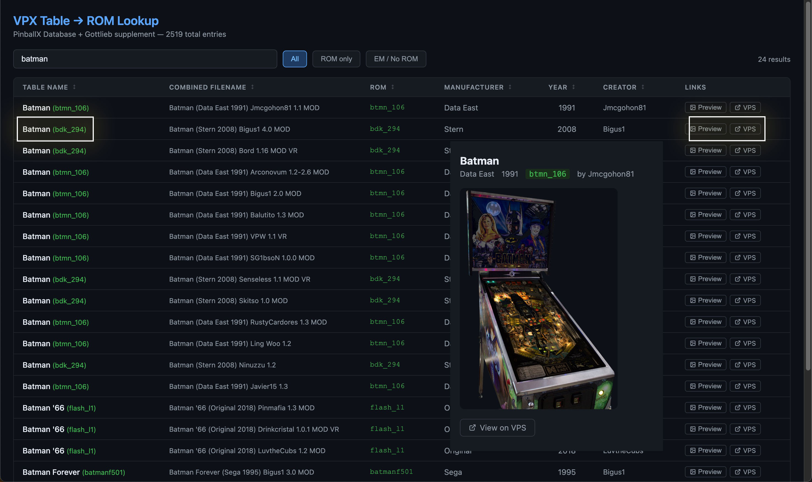

# VPX ROM Lookup

Simple HTML-based VPX ROM lookup tools with table search, VPS links, and cabinet image preview.
 

## Screenshot

 

<h1>Desktop version</h1> 

<h1>Mobile version</h1> 

## Features

- Search by table name, ROM, or combined metadata
- Filter by `All`, `ROM only`, and `EM / No ROM`
- Open table on VPS (`virtualpinballspreadsheet.github.io`)
- Preview cabinet image from:
  - `https://github.com/superhac/vpinmediadb/raw/refs/heads/main/<gameId>/cab.png`

## Usage

1. Open either HTML file directly in your browser.
2. Type a table name or ROM in the search box.
3. Click `Preview` to open the cabinet image modal.
4. Click `VPS` to open the table entry in the VPS sheet.

## Notes

- This project is static HTML/CSS/JavaScript (no build step).
- Data is embedded directly in each HTML file.
